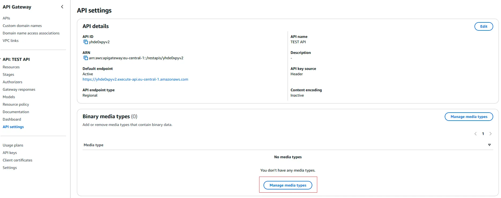
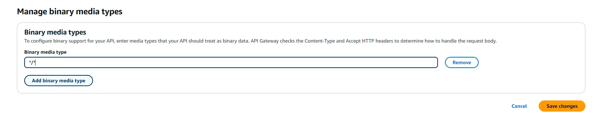

> This post only covers the `@codegenie/serverless-express` package.

## Serverless Express

You may have used Serverless Express before, whether to deploy on AWS or similar platforms, but if you've ever had to generate a PDF and send it back, things can get complicated. However, if you're here, you probably know what I'm talking about.

Let's imagine you have an endpoint, for example: `/api/v1/pdf/invoices`. When you query that endpoint, you'll receive a blank PDF, but with pages corresponding to the original PDF - meaning the content seems to take up space, but everything arrives blank.

This is due to the binary content type configuration. To fix it, it's as simple as using this piece of code:

```javascript
// lambda.js
const serverlessExpress = require('@codegenie/serverless-express');
const app = require('./app');
exports.handler = serverlessExpress({
	app,
	binarySettings: {
		isBinary: true,
		contentTypes: ['application/pdf']
	}
});
```

With this code, we can work around the limitations that API Gateway has when sending content in binary format and transform it into Base64, which is a format that it accepts by default.  
Keep in mind that our API Gateway also needs to accept this type of content. We can configure this from the settings in the left panel of the AWS control panel.






With that, you should now be able to download PDFs from any Express route.
