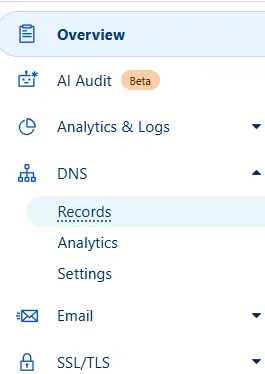
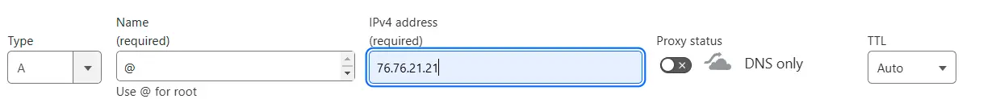
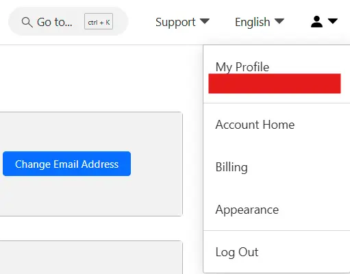
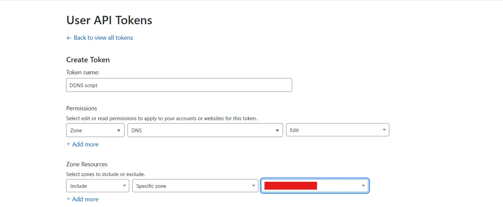

## What is DDNS

It's a service that automatically updates a domain's public IP address when it changes.  
It's useful for internet connections with dynamic IP, like most people have at home.  
Using this type of service allows us to keep our router's IP updated (it usually changes when restarted or, for example, during a power outage).

## What I need

- Computer with Linux or virtual machine with internet access
- Cloudflare account with a purchased domain

## Step 1: Get the necessary data from Cloudflare

First, we log into our Cloudflare account on the homepage.

Once inside, go to **DNS > Record**  


Then, create a new record pointing to our current IP or a fictitious one, as it will be temporary.  


Now we'll need the **ZONE ID**, which we can get from the **Overview** section.  


We'll also need to create an **API Key** to use in the script.  


Move to the **API tokens** section  


Create a new token and choose the **"Edit zone DNS"** template.  
Once inside, we just need to change the zone it points to.  


Save and create the token. It will give you the option to copy it. **Copy it and save it to use later in the script.**

## Step 2: Create the script

Create a user for the script. You can use one you already have if you wish.

```bash
sudo adduser --disabled-password --gecos "" cloudflare-ddns
```

Switch to the new user:

```bash
sudo su cloudflare-ddns
```

Run the following commands:

```bash
mkdir $HOME/cloudflare-ddns/; cd $HOME/cloudflare-ddns/; \
wget https://raw.githubusercontent.com/fire1ce/DDNS-Cloudflare-Bash/main/update-cloudflare-dns.sh; \
wget https://raw.githubusercontent.com/fire1ce/DDNS-Cloudflare-Bash/main/update-cloudflare-dns.conf; \
chown $USER:$USER -R $HOME/cloudflare-ddns; chmod 600 update-cloudflare-dns.conf; \
chmod 700 update-cloudflare-dns.sh
```

Edit the `.conf` file and change the variables with the data we previously obtained from Cloudflare.

```bash
nano $HOME/cloudflare-ddns/update-cloudflare-dns.conf
```


Now we can test running the script:

```bash
./update-cloudflare-dns.sh ./update-cloudflare-dns.conf
```

If there are no errors, congratulations. You can add the script execution to **crontab**:

```bash
# crontab -e
* * * * * $HOME/cloudflare-ddns/update-cloudflare-dns.sh update-cloudflare-dns.conf
# ctrl+o (save) > ctrl + x (exit)
```

And that's it. With this, the script will be running and you won't have to worry about updating the DNS every time it changes. 🚀
