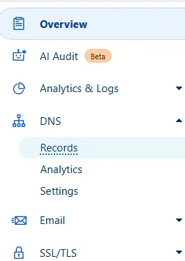
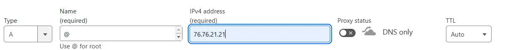
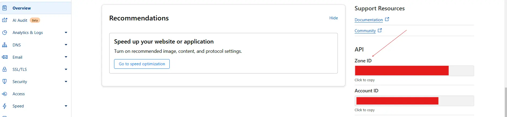
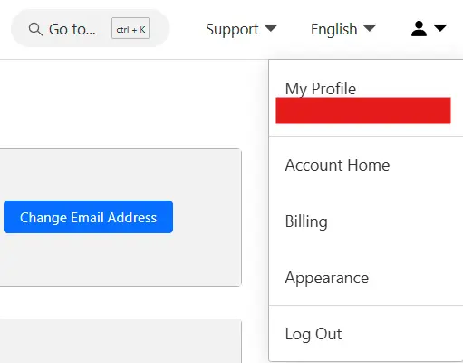
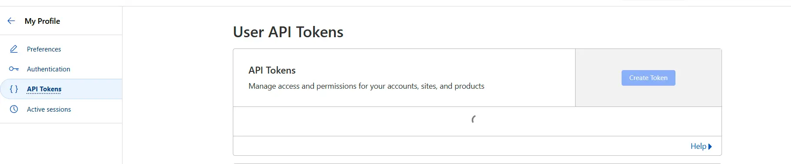
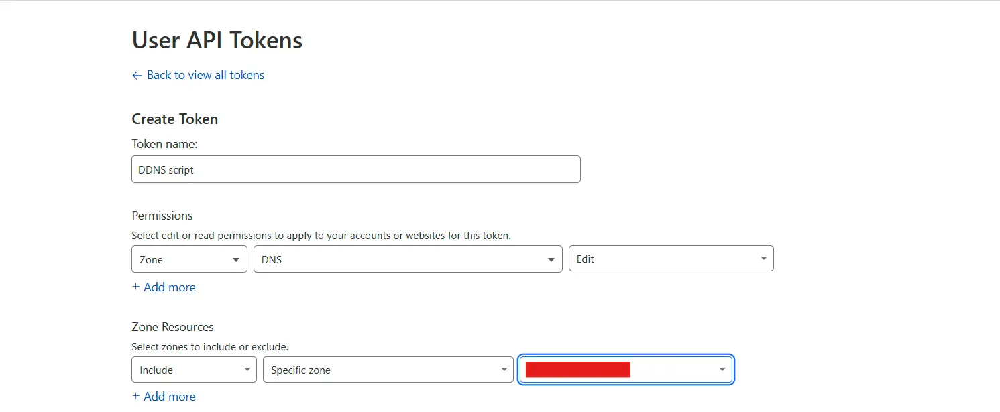
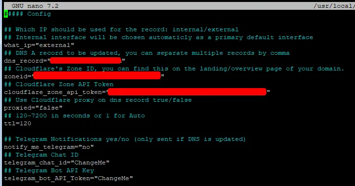

## Qué es un DDNS

Es un servicio que actualiza automáticamente la dirección IP pública de un dominio cuando cambia.  
Es útil para conexiones a internet con IP dinámica, como la que tienen la mayoría de las personas en sus casas.  
Utilizar este tipo de servicio nos permite mantener actualizada la IP de nuestro router (suele variar cuando se reinicia o, por ejemplo, cuando sufrimos un corte de luz).

## Qué necesito

- Ordenador con Linux o máquina virtual con acceso a internet
- Cuenta en Cloudflare con un dominio comprado

## Paso 1: Conseguir los datos necesarios de Cloudflare

Primero, entramos a nuestra cuenta de Cloudflare en la página de inicio.

Una vez dentro, vamos a **DNS > Record**  


Después, creamos un nuevo registro apuntando a nuestra IP actual o a una ficticia, ya que será temporal.  


Ahora necesitaremos el **ZONE ID**, que podemos conseguir desde la sección de **Overview**.  


También necesitaremos crear una **API Key** para usarla en el script.  


Nos movemos a la sección de **API tokens**  


Creamos un nuevo token y elegimos la plantilla de **"Edit zone DNS"**.  
Una vez dentro, solo tenemos que cambiar la zona a la que apunta.  


Guardamos y creamos el token. Nos dará la opción de copiarlo. **Cópialo y guárdalo para usarlo más tarde en el script.**

## Paso 2: Crear el script

Crear un usuario para el script. Puedes utilizar uno que ya tengas si así lo deseas.

```bash
sudo adduser --disabled-password --gecos "" cloudflare-ddns
```

Cambiamos al nuevo usuario:

```bash
sudo su cloudflare-ddns
```

Lanzamos los siguientes comandos:

```bash
mkdir $HOME/cloudflare-ddns/; cd $HOME/cloudflare-ddns/; \
wget https://raw.githubusercontent.com/fire1ce/DDNS-Cloudflare-Bash/main/update-cloudflare-dns.sh; \
wget https://raw.githubusercontent.com/fire1ce/DDNS-Cloudflare-Bash/main/update-cloudflare-dns.conf; \
chown $USER:$USER -R $HOME/cloudflare-ddns; chmod 600 update-cloudflare-dns.conf; \
chmod 700 update-cloudflare-dns.sh
```

Editamos el archivo `.conf` y cambiamos las variables con los datos que hemos conseguido previamente de Cloudflare.

```bash
nano $HOME/cloudflare-ddns/update-cloudflare-dns.conf
```



Ahora podemos probar a ejecutar el script:

```bash
./update-cloudflare-dns.sh ./update-cloudflare-dns.conf
```

Si no da ningún error, enhorabuena. Puedes añadir a **crontab** la ejecución de este script:

```bash
# crontab -e
* * * * * $HOME/cloudflare-ddns/update-cloudflare-dns.sh update-cloudflare-dns.conf
# ctrl+o (guardar) > ctrl + x (salir)
```

Y listo. Con esto el script estará funcionando y no tendrás que preocuparte de actualizar el DNS cada vez que cambie. 🚀
