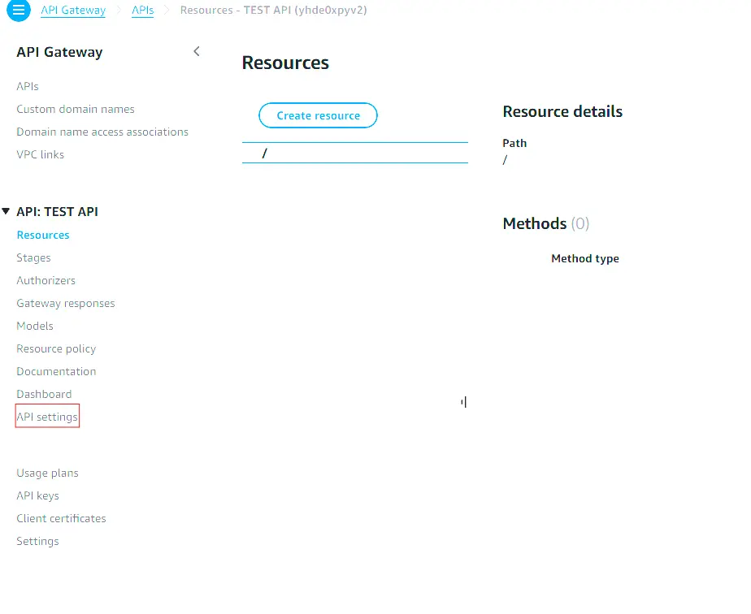

> Este post solo cubre el paquete `@codegenie/serverless-express`.

## Serverless Express

Tal vez hayas usado alguna vez Serverless Express, ya sea para desplegarlo en AWS o derivados, pero si alguna vez has tenido que generar un PDF y enviarlo de vuelta, la cosa se puede complicar. Aunque, si ya estás aquí, seguro que sabes de lo que hablo.

Imaginemos que tienes un endpoint, por ejemplo: \`/api/v1/pdf/facturas\`. Al momento de consultar ese endpoint, te va a llegar un PDF en blanco, pero con las páginas correspondientes al PDF original, es decir, el contenido parece que ocupa espacio, pero a ti te llega todo en blanco.

Esto se debe a la configuración de tipos de contenido binarios. Para solucionarlo, es tan fácil como usar este trozo de código:

```javascript
// lambda.js
const serverlessExpress = require('@codegenie/serverless-express');
const app = require('./app');
exports.handler = serverlessExpress({
	app,
	binarySettings: {
		isBinary: true,
		contentTypes: ['application/pdf']
	}
});
```

Con este código podemos sortear las limitaciones que tiene API Gateway a la hora de enviar contenido en formato binario y transformarlo en Base64, que sí es un formato que acepta por defecto.  
Hay que tener en cuenta que nuestro API Gateway también tiene que aceptar este tipo de contenidos. Esto lo podemos configurar desde los ajustes en la parte izquierda del panel de control de AWS.




Con eso, ya deberías poder descargar PDFs desde cualquier ruta de Express.
